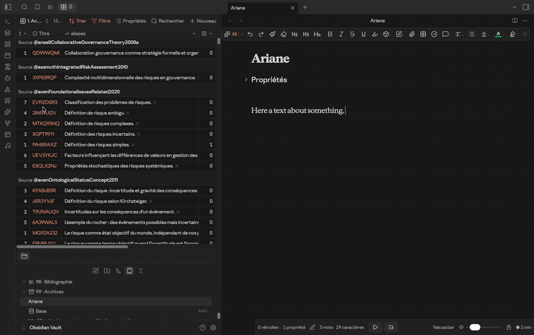
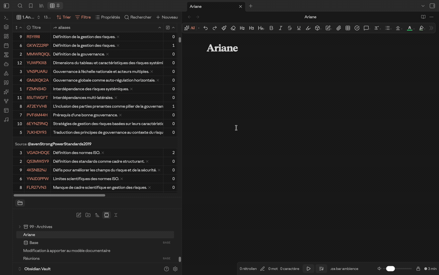
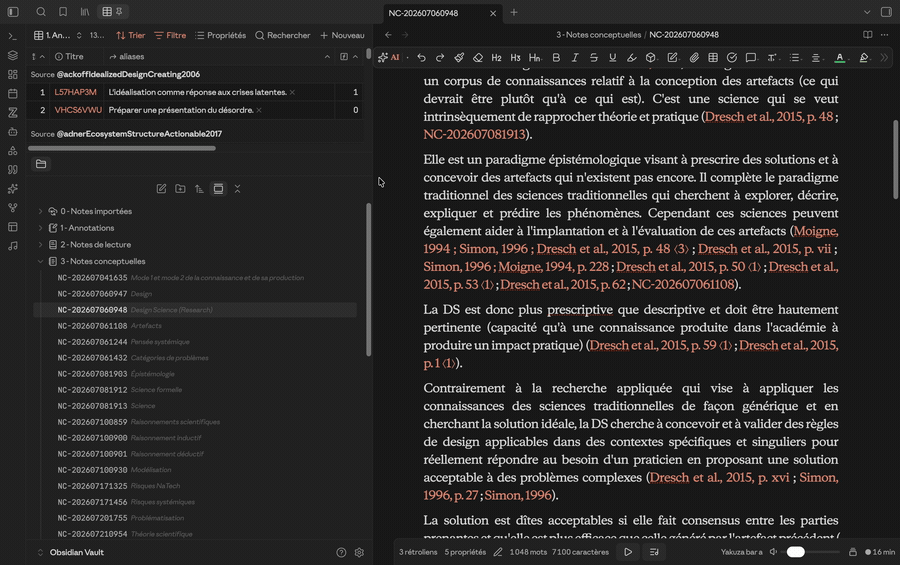
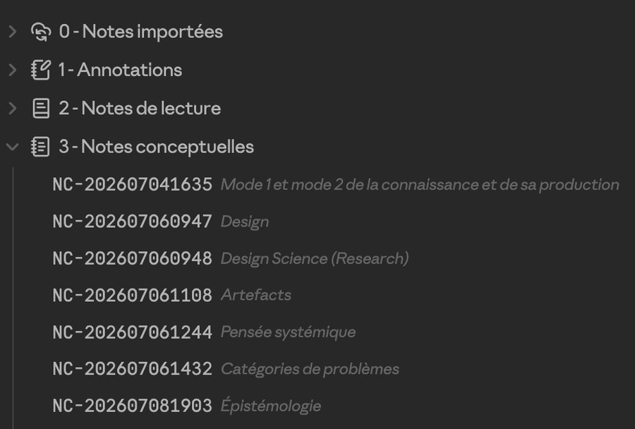
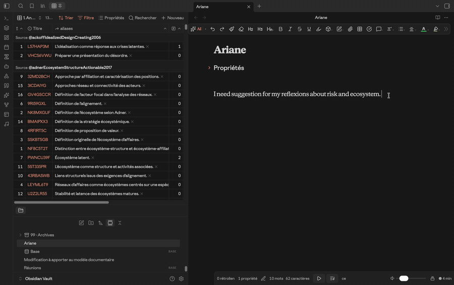
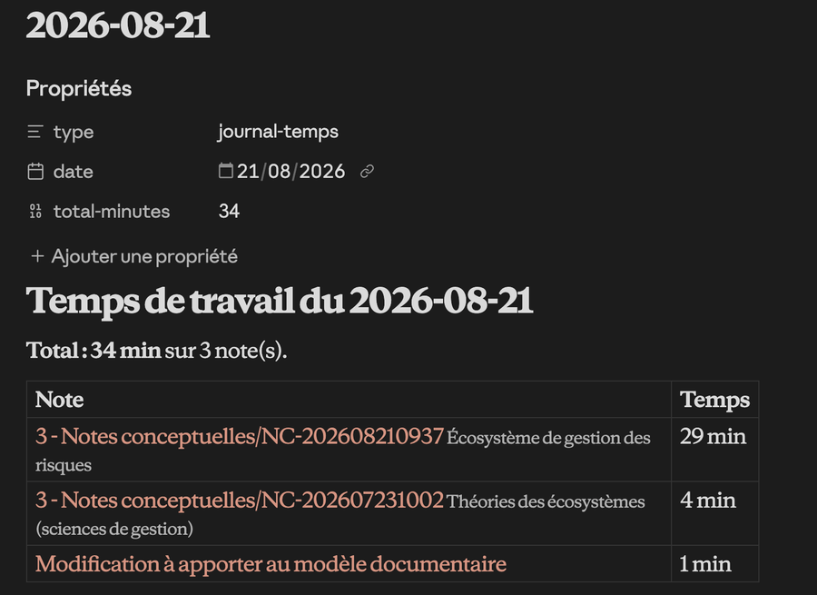

# Ariane

> 🤖 **Written by vibe coding with Claude.** This plugin was designed and written
> in conversation with Claude (Anthropic), from the real needs of a doctoral
> student. I am not a developer. I describe what I need, I test, I correct, and
> the code takes shape through the exchange. I say this up front, out of
> honesty, so you know what you are installing. The code is readable, commented,
> and has no dependency: a single `main.js` file, no TypeScript, no bundler, no
> `npm`.
>
> *Français : voir [README.fr.md](README.fr.md).*

🔗 **Ariane is the downstream companion of [ZotFlow](https://github.com/duanxianpi/zotflow).**
ZotFlow brings Zotero into Obsidian: references, attachments, annotations,
notes. Ariane picks up from there and works that material. It atomises it,
links it, cites it and exports it. Without ZotFlow, Ariane has nothing to work
on.

🌍 Interface available in **English and French**.

---

## 🧭 Table of contents

- [⚠️ Before you start](#-before-you-start)
- [⚛️ Atomising](#-atomising)
- [🧮 A base for your annotations](#-a-base-for-your-annotations)
- [🔖 Citing Zotero, live](#-citing-zotero-live)
- [🖱️ Drag and drop](#-drag-and-drop)
- [🪗 Folding citations](#-folding-citations)
- [🏷️ The aside](#-the-aside-or-reading-coded-names)
- [✨ Suggestions](#-suggestions)
- [↩️ Back to Zotero](#-back-to-zotero)
- [📚 Bibliographies](#-bibliographies)
- [⏳ Pending references](#-pending-references)
- [👥 Authors](#-authors)
- [📝 Exporting to Word](#-exporting-to-word)
- [⏱️ Tracking time](#-tracking-time)
- [🧹 Housekeeping tools](#-housekeeping-tools)
- [🗂️ Fitting your own organisation](#-fitting-your-own-organisation)
- [⌨️ Commands](#-commands)
- [📦 Installing](#-installing)
- [☕ Buy me a coffee](#-buy-me-a-coffee)

---

## ⚠️ Before you start

Read this first. Everything else depends on it. 🧱

Ariane does not read your PDF, it reads what **you** wrote in Zotero. So the way
you write your annotation comments is the contract between the two tools, and
the most important part of that contract is the **title**.

The expected shape, with the profile shipped by default, is this:

```
**A short title for this idea**
Your paraphrase, in your own words, over as many lines as you like.
*(Fan et al., 2022 ; Stål et al., 2023)*
```

Three lines, three roles:

1. 🏷️ **The title, in bold, on the first line. This one is required.** It
   becomes the name of the note, the label you see in the file explorer, in the
   suggestions panel and in every link pointing to that annotation.
2. ✍️ **The paraphrase**, on the lines that follow. Optional, and free.
3. 📎 **The secondary references, in italics, on the last line.** Optional. See
   below.

Be aware of what happens without a title: by default, an annotation whose
comment does not open with a bold line is **not atomised at all**. It is not
turned into a note with a missing name, it is simply skipped, and the passage
stays in Zotero without ever reaching your vault.

🩹 That default can be lifted. In *Advanced → Untitled annotations*, turn
**Atomise untitled annotations** on: the whole comment then becomes the
paraphrase, and Ariane infers a title from it, cutting at the end of the first
sentence or at the last whole word. You choose whether the title is taken from
the comment or from the highlighted text, and how long it may run. It works
well, and it is still a fallback: a title you wrote yourself will always beat a
title a machine guessed.

So the habit to build is the same one every time: highlight, then write a bold
title, then paraphrase. It costs a few seconds per annotation and it is what
makes the whole vault navigable afterwards.

🤖 **You do not have to write it by hand.** I keep a second plugin for that, on
the Zotero side: [**Annota**](https://github.com/Liotou/zotero-annota). You
assign a prompt to each highlight colour, and the moment you highlight a
passage, the model writes the comment for you, already shaped: bold title,
paraphrase, italic references. The academic prompt shipped with it produces
exactly the structure described above, which is no accident. Annota is optional
and independent, and Ariane never needs it, but it is what turns the discipline
into a reflex.

📐 **This shape is not imposed.** If your own convention differs, the *Analysis*
tab lets you describe it: a profile is a pair of regular expressions, one for the
title and one for the reference line. You may declare several profiles, and
Ariane uses the first one that matches. The default profile simply follows what
ZotFlow writes.

### 📎 Secondary references, entirely optional

The italic last line is for the works the passage **reports** without being their
author, the ones you would write as "as cited in".

```
**Two ways of producing knowledge**
The authors distinguish mode 1 from mode 2 and take up the earlier framing.
*(Gibbons, 1994 ; Nowotny et al., 2001)*
```

Write nothing there and you lose nothing: the annotation is atomised as usual,
with its title and its paraphrase. Write it and Ariane takes it in hand. It
turns each name into a pending reference, groups the works reported by the same
source into a single citation, checks whether the reported work is already in
your Zotero library, and cites it directly when it is. It also builds the
authors and pending references pages from it.

It is an addition, never a requirement. 🙂

---

## ⚛️ Atomising

Every Zotero annotation becomes a standalone note with a stable identity that
survives regeneration. Rename the note, edit its paraphrase, move it: the link
to the source holds.

**Zotero child notes**, the ones attached to the whole reference rather than to
a single passage, become reading notes in their own right, citable and linked
back to their source. The Zotero citations they contain are converted into
Ariane citations along the way, so they feed your bibliography like any other.

Three behaviours you can turn on or off:

- **regeneration**: when the source changes, the annotations are rebuilt;
- **deletion propagation**: when an annotation disappears from Zotero, its note
  is deleted and its links are removed. This one is destructive, and off by
  default;
- **locking**: generated notes carry `locked: true` and cannot be edited by
  accident.

Annotations that no note ever cites can be **tagged** automatically, which lets
you colour them in the graph and see at a glance what you have read but never
used.

## 🧮 A base for your annotations

Atomising gives you thousands of small notes. To actually see them, Obsidian has
**Bases**, its built in database view, and Ariane writes exactly the properties a
base needs. This view is **not shipped with the plugin**: a base is a file in
your vault, yours to shape, so here is everything you need to build it. A ready
made one sits in [`docs/annotations.base`](docs/annotations.base), which you can
copy into your vault and open straight away. 📋

### What Ariane writes on every annotation note

| Property | Contents |
| --- | --- |
| `aliases` | the annotation title, the readable name |
| `zotflow-anno-key` | the Zotero annotation key, stable across regenerations |
| `zotflow-source` | a link to the source note, `[[@authorTitle2020]]` |
| `ordre` | position of the annotation in the document |
| `page` | page in the PDF |
| `couleur` | Zotero highlight colour, as a readable name |
| `références-citées` | links to the secondary works the passage reports |
| `références-pages` | the page given for each of them |
| `collections` | the Zotero collections, from root to leaf |
| `couleur`, `zotflow-auto`, `zotflow-locked` | colour, generated, locked |
| `tags: orphelin` | added to annotations no note ever cites |

Source notes come from ZotFlow and carry `citationKey`, `title`, `creators`,
`year`, `itemType`, `zotero-key` and `collections`. A base can reach them from an
annotation through `asFile()`, which is what makes the whole thing work.

### The formulas

```yaml
formulas:
  source: note["zotflow-source"]
  appels: file.backlinks.length
  auteurs: note["zotflow-source"].asFile().properties["creators"]
  annee: note["zotflow-source"].asFile().properties["year"]
```

`source` gives you a clickable link to the reference. `appels` counts how many
notes cite this annotation, which is the single most useful column: it separates
the material you have exploited from the material you merely collected. The last
two reach into the source note and pull the author and the year back out, so you
can sort annotations by author without ever leaving the table.

### Sorting by Zotero collection

`collections` is a list running from the root down to the deepest folder, for
example `My Library`, `Doctorat`, `04 - Risks`, `Systemic risk`. The first two
carry no information, so drop them, and what remains is your actual thematic
path:

```yaml
formulas:
  chemin: note["collections"].filter(value.toString().containsAny("My Library", "Doctorat") == false).join(" › ")
  collection: note["collections"].filter(value.toString().containsAny("My Library", "Doctorat") == false).reverse().slice(0, 1).join("")
```

`chemin` renders the whole path, `collection` keeps only the last item, the
deepest subcollection, which is the right key to group by. Replace the two names
with whatever your own library puts at the top.

```yaml
    groupBy:
      property: formula.collection
      direction: ASC
```

Group a table this way and you read your corpus by theme rather than by
reference: every annotation on systemic risk together, whichever book it came
from. **Obsidian prints the number of rows in each group header, so grouping is
already a counter.** 🔢

### Counting annotations per source

The other direction is a table whose rows are the **sources**, with the number of
annotations each one produced. Backlinks give it to you:

```yaml
formulas:
  annotations: file.backlinks.filter(value.asFile().path.startsWith("1 - Annotations/")).map(value.asFile().path).unique().length
  jamaisCitees: file.backlinks.filter(value.asFile().path.startsWith("1 - Annotations/")).filter(value.asFile().hasTag("orphelin")).map(value.asFile().path).unique().length
```

Read it from the inside out: take everything that links to this source, keep only
what lives in the annotations folder, reduce each one to its path, remove
duplicates, count. The `map` and `unique` steps matter: an annotation links to
its source twice, once in its properties and once in its body, and without them
every source would count double. `jamaisCitees` adds one filter and tells you how
much of what you read you never used.

Filter the view with `file.hasProperty("zotero-key")` to keep the ZotFlow source
notes and nothing else, then sort by `formula.annotations` descending. You get
your reading effort ranked, most annotated first, with the unused share beside
it. Adapt `"1 - Annotations/"` to your own folder name.

### Views worth having

- **by source**, grouped on `formula.source`, sorted by `ordre`: the annotations
  of a book in reading order;
- **by Zotero collection**, grouped on `formula.collection`, sorted by
  `formula.appels` descending: your themes, most exploited first;
- **never cited**, filtered on `file.backlinks.length == 0`: what you have read
  and never used;
- **counter per source**, described above;
- **by colour**, grouped on `note.couleur`, as cards: useful if your highlight
  colours carry a meaning, definition, objection, method.

## 🔖 Citing Zotero, live

Citations are written in plain sight inside your notes:

```
([[KEY|Dresch et al., 2015, p. 63]] ; [[OTHER|Gibbons, 1994, p. 12]])
```

The label is produced from a template you control, for example
`{{auteurs}}, {{annee}}, p. {{page}}`. The citation goes before the closing
punctuation, as French typography wants.

**Secondary sources.** When an annotation reports a work you have not read
yourself, Ariane writes it as "Fan et al., 2022 and Stål et al., 2023, as cited
in Raizada & Sinha, 2025, p. 1". Several works reported by the same source are
gathered into a single citation, so the reference style cannot collapse the
author name of the second one. If the reported work is itself in Zotero, it is
cited directly instead, since you can read it.

Rather than naming every reported work in the running text, the source can carry
a **counter** instead, and hovering it shows them as clickable links.

## 🖱️ Drag and drop

This is the fastest way to cite while writing.



**Drag an annotation, or a source, onto a sentence.** Its reference is inserted
inline, in brackets, before the closing punctuation. You never leave the
keyboard flow for more than a second.

In the recording above, three annotations are dropped one after another onto the
same sentence. Each one inserts its citation before the full stop, and the
bibliography at the end of the note builds itself as they arrive.

The target follows your cursor: hovering the **text** places the citation at the
end of the sentence under the pointer, hovering the **left margin** of the
paragraph places it at the end of the paragraph. The area being targeted is
highlighted while you drag, so you see where it will land before you let go.

The **annotation basket**, opened from the ribbon, lets you gather annotations
as you read, then place the whole set at once when you write. Drag the basket
onto a paragraph, or drop it at the cursor, and every annotation it holds
arrives as a single citation.



Four annotations are gathered here, from three different sources, and land in
one go as `(Aven and Renn, 2010, p. 49 ; Aven and Renn, 2010, p. 65 ; Aven and
Ylönen, 2019, p. 285 ; Babeau, 2025)`. The bibliography follows on its own.

Two details that took some work:

- reusing a citation is a **copy**, never a move. Without forcing that, the
  editor would remove the citation from the paragraph it came from;
- a link rendered outside a markdown view arrives with an empty payload, so
  Ariane records the dragged item at the moment the drag starts, which is the
  only reliable moment.

You can choose whether any note may be dropped or only annotations, and whether
Ariane tells you when a dropped item matches nothing in the vault, rather than
silently doing nothing.

## 🪗 Folding citations

A long citation can crowd the reading. Fold it, and it gives way to a small
badge carrying the number of references it holds.



The note above holds five citations, and reads as continuous prose. The badges
carry two, seven, two, three and one reference respectively, and give them back
the moment you need them.

- click the badge to unfold that one citation;
- use the commands, or the ribbon button, to fold or unfold the whole note;
- while editing, a citation unfolds on its own as soon as the cursor enters it,
  and folds again when you leave.

## 🏷️ The aside, or reading coded names

A vault built this way fills up with names nobody can read. Annotation notes are
named after their Zotero key, `6BH5SHHB`. Concept notes carry a timestamp,
`NC-202607041635`. Those names are excellent for the machine, stable and never
colliding, and useless for you. The aside gives you back the reading without
touching a single character of your files. ✨

**Inside a note**, the aside prints the title just after the link, in reading
view and while editing. You write `[[6BH5SHHB]]` and you read
`[[6BH5SHHB]] Two ways of producing knowledge`. Its format, colour and size are
yours to set, and you decide family by family which notes get one.

**In the file explorer**, the same idea applies to filenames. Ariane can show
the **alias instead of the filename**, and display chosen folders in a **fixed
width font** so the coded part lines up column by column.



The folder above holds concept notes. The reference is on the left, aligned and
scannable, and the alias reads beside it: `NC-202607060948` is *Design Science
(Research)*, `NC-202607061244` is *Systems thinking*. You keep a stable
identifier and a readable name at the same time, without choosing between them.

Both displays are decoration only. The file on disk is untouched, the filename
is untouched, so search, sorting, backlinks and any other plugin keep seeing
exactly what was always there. Turn the option off and everything falls back to
its coded name.

## ✨ Suggestions

A side panel proposes the closest notes as you write.

Three engines: **lexical** (shared words, no dependency at all), **semantic**
(meaning, through local embeddings) and **hybrid**, which combines the two and
is the recommended choice. Everything runs locally, offline and free of charge,
through **Ollama or LM Studio**.



- filter the panel by note family, with the colour and icon you gave each one;
- **right click a passage** to get suggestions for that passage alone, rather
  than for the whole note;
- **drag a suggestion** straight into your text to cite it;
- the ✨ button reranks the best candidates with a local language model, on
  demand only.

⚡ That last point matters. Reranking is by far the heaviest thing the plugin does,
so it never starts on its own, it is bounded both in answer length and in time,
and nothing is computed at all while the panel is not actually visible.

## ↩️ Back to Zotero

A button in the ZotFlow reader, and a command, take you back to Zotero at the
right place:

- from the **reader**, Zotero opens the same PDF at the page you were on;
- from an **annotation note**, Zotero opens the PDF and scrolls to that very
  highlight;
- from a **source note**, Zotero opens its attachment, or selects the entry if
  there is none.

## 📚 Bibliographies

**At the end of a note.** Ariane collects the sources cited in the body and
maintains a bibliography between two markers, the way Zotero does in Word. The
formatting is the one ZotFlow already produced, so your citation style is
respected. Each entry gets a clickable link placed after it, never around it,
so the italics of the style survive.

Sort by author or by order of appearance, and rebuild in the active note or
across the whole vault.

**Per source.** Ariane can fetch the works a source itself cites, through
Crossref and OpenAlex, and write them into a dedicated note. Give it an email
address and the two services grant you better rate limits.

## ⏳ Pending references

A reference cited by one of your annotations but absent from Zotero is not lost.
Ariane keeps it as a provisional note, and tries to attach it to a real Zotero
entry by author and year.

Certain matches, where only one pairing is possible, are attached without asking
anything. For **ambiguous** cases you choose the behaviour: skip them, let a
local language model decide, or be asked each time. A decision you make by hand
is remembered and never asked again, and you can wipe those memories in one
click.

There is also a command for the classic **2005a and 2005b** problem, where you
link a given reference to the right Zotero entry yourself.

## 👥 Authors

Ariane can keep one note per author, listing their sources. Author names arrive
in many shapes, so a command finds the **duplicates**, groups the variants, and
lets you tick which ones to merge and which entry to keep.

## 📝 Exporting to Word

The hardest part, and the most polished: a `.docx` export **with live Zotero
fields**, not frozen text. Reopen the document in Word, click Refresh, and
Zotero redoes the formatting.

Layout is **driven by your own Word template**, not by the code. You place
tokens in it, the plugin fills them in:

| Token | Filled with |
|---|---|
| `{{titre}}` | the note title |
| `{{dossier}}` | its folder, without any leading number |
| `{{date}}` `{{date:long}}` | its creation date, short or spelled out |
| `{{réf}}` | its reference, from a property or from the filename |
| `{{propriété:key}}` | a named property |
| `{{propriétés.nom}}` / `{{propriétés.valeur}}` | a row repeated for each remaining property |
| `{{encadré.titre}}` / `{{encadré.contenu}}` | your `> [!info]` callouts, wrapped in the frame you designed |

Move a token, add a row, change a style, redesign the frame: all of that happens
in Word. A command **checks your template** and tells you what it found, which
tokens it does not recognise, and which layouts are missing.

Along the way the export also:

- shifts headings by one level, so `##` becomes Heading 1, and strips numbering
  you typed by hand, leaving Word to number on its own;
- turns `> [!info]` callouts into the framed table from your template;
- converts markdown tables, with borders and your own table styles;
- removes the brackets from property values, so `[[Jane Doe]]` comes out as
  `Jane Doe`;
- turns spaces already present before `;` `:` `!` `?` into non breaking ones,
  without ever adding a space, so URLs and clock times stay intact;
- adds the Zotero bibliography field at the end, so you do not have to insert it
  yourself.

⚠️ Requires pandoc, the Better BibTeX Lua filter, and Zotero running.

## ⏱️ Tracking time

Time spent in each note, in minutes, written back to a property.

It pauses on its own as soon as keyboard and mouse go quiet, or the window
loses focus, so it counts actual work rather than presence in front of the
screen. You set how long the silence must last.

The reference total is kept in seconds and the property is only a rounded view
of it, because rounding at every write, starting from an already rounded value,
inflates the total by several percent. Writes are spaced out so your sync stays
quiet, and pending time is never lost.

A **daily journal** can be written automatically when the day turns, and a
status bar item shows the time on the current note, solid while the timer runs
and hollow when paused. The journal is an ordinary note, so it stays searchable
and links back to the work it accounts for:

```markdown
---
type: journal-temps
date: 2026-08-21
total-minutes: 34
---
# Temps de travail du 2026-08-21

**Total : 34 min** sur 3 note(s).

| Note | Temps |
| --- | --- |
| [[3 - Notes conceptuelles/NC-202608210937]] | 29 min |
| [[3 - Notes conceptuelles/NC-202607231002]] | 4 min |
| [[Modification à apporter au modèle documentaire]] | 1 min |
```



Because every row is a real link, the journal appears in the backlinks of the
notes it mentions. Opening a note months later tells you how long it took.

## 🧹 Housekeeping tools

- **Rename a property** across the whole vault. Changing a name in the settings
  only affects future writes, so this carries the old value over to the new one.
  It counts first, and never overwrites a note that already has the new property.
- **Export and import a settings profile**. Paths specific to your machine never
  travel with it, and an imported profile never touches them.
- **Check the Word template**, before an export rather than after.
- **Restore** any generated note that was edited by hand.

## 🗂️ Fitting your own organisation

Ariane assumes nothing about your vault. You describe your **note families** in
the settings, giving each a label, one or more folders, an optional filename
prefix, and what Ariane should do with them: show the title after links, feed
the suggestions, change the look in the file explorer. Rows are reordered by
dragging them. No note type is named in the code.

One button proposes the families found in your vault and **guesses their
prefixes** from the filenames. Another detects which folders play each
functional role, meaning where annotations are filed, where reading notes go,
where exports land, and so on.

## ⌨️ Commands

| Command | What it does |
|---|---|
| Atomise the active source note | one note per annotation |
| Re-atomise every source | the whole vault |
| Reading notes: atomise Zotero child notes | notes attached to the reference itself |
| Citations: fold all, unfold all, fold or unfold | the badges |
| Citations: refresh labels | after changing the citation template |
| Bibliography: rebuild in the active note, or in every note | end of note bibliography |
| Build the cited bibliography of this source, or of every source | through Crossref and OpenAlex |
| Attach pending references to Zotero sources | by author and year |
| Link this reference to a Zotero entry | the 2005a and 2005b case |
| Merge duplicate authors | groups the name variants |
| Open in Zotero | reader, annotation or source |
| Check the Word template | tokens and layouts |
| Export to Word with live Zotero citations | the whole chain |
| Time: write today's journal, write it into the notes now | the timer |
| Annotation basket: show or hide | for drag and drop |
| Annotation suggestions: open the panel, rebuild the index | the side panel |

---

## 📦 Installing

Ariane is not in the official Obsidian catalogue. Two ways in:

**With BRAT** ✅ (recommended, automatic updates)
1. install the [BRAT](https://github.com/TfTHacker/obsidian42-brat) plugin;
2. run the command "BRAT: Add a beta plugin for testing";
3. paste `Liotou/obsidian-ariane`.

BRAT follows the releases of this repository and offers you updates.

**By hand**
Download `main.js`, `manifest.json` and `styles.css` from the
[latest release](../../releases/latest) and drop them into
`YourVault/.obsidian/plugins/zotflow-atomiser/`.

### For the Word export
- [pandoc](https://pandoc.org/);
- the Lua filter from [Better BibTeX](https://retorque.re/zotero-better-bibtex/)
  (`pandoc-zotero-live-citemarkers.lua`);
- Zotero running, with Better BibTeX;
- your own `.docx` template carrying the tokens.

### For semantic suggestions
[Ollama](https://ollama.com/) or [LM Studio](https://lmstudio.ai/), with an
embedding model. `bge-m3` handles French well.

---

## 🙏 Thanks

**[ZotFlow](https://github.com/duanxianpi/zotflow)** first and foremost. Ariane
would be nothing without it. ZotFlow is what makes Zotero live inside Obsidian,
and everything Ariane does starts from what ZotFlow puts there. Thank you to
[Xianpi Duan](https://github.com/duanxianpi), who built it.

Thanks as well to [Better BibTeX](https://retorque.re/zotero-better-bibtex/) and
its pandoc filter, without which live citations in Word would remain wishful
thinking.

---

## ☕ Buy me a coffee

If Ariane saves you time, you can [buy me a coffee](https://buymeacoffee.com/liotou).

I said at the top that this plugin was written by vibe coding with Claude, and I
stand by it. But a model does not know what a reading note should look like, nor
why a citation goes before the full stop, nor what breaks when you regenerate an
annotation whose paraphrase you have edited. All of that came from months of
writing my own thesis, of testing, of finding what was wrong and saying so, over
and over. The code is not mine. The plugin is. ☕

---

## ⚖️ Licence

MIT, see [LICENSE](LICENSE).
